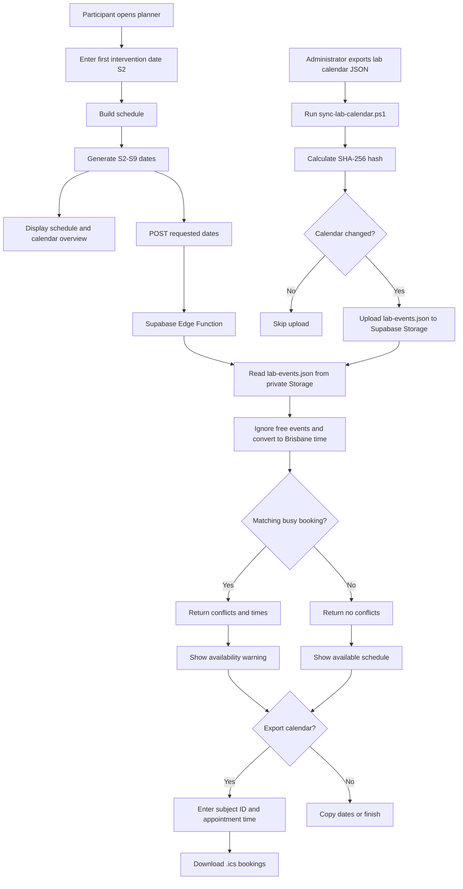

# Session Schedule Planner

A dependency-free browser application for planning the Hip Osteoarthritis Gait Intervention Program study. A single first intervention date produces the six intervention sessions, the three-month follow-up, and the one-year follow-up.

## Schedule rules

The first intervention date is Session 2. The remaining sessions are calculated as follows:

| Session | Date rule | Estimated appointment duration |
| --- | --- | --- |
| S2 | Starting date | About 1 hour |
| S3 | 1 week after S2 | About 1 hour |
| S4 | 3 weeks after S2 | About 1 hour |
| S5 | 6 weeks after S2 | About 1 hour |
| S6 | 9 weeks after S2 | About 1 hour |
| S7 | 11 weeks after S2 | About 2 hours |
| S8 | Nearest matching weekday to 3 calendar months after S7 | About 2 hours |
| S9 | Nearest matching weekday to 1 calendar year after S2 | About 2 hours |

All sessions remain on the weekday selected for S2. The planner displays the dates in a list and month-by-month calendar, and provides copy and calendar-export actions.

## End-to-end workflow



## Repository structure

```text
index.html                         User interface
app.js                             Schedule, calendar export, and availability client
styles.css                         Responsive and printable styling
scripts/sync-lab-calendar.ps1      Uploads the latest lab calendar data
supabase/functions/check-availability/index.ts
																		Availability-checking Edge Function
```

## Run locally

No package installation or build step is required. From the repository root, start a local server:

```powershell
python -m http.server 8000
```

Open <http://localhost:8000>. A local server is recommended because browser requests from a `file://` page may not behave like the deployed application.

## Participant workflow

1. Open the planner.
2. Enter the date of the first intervention session, S2.
3. Select **Build schedule**.
4. Review all eight dates, estimated durations, the calendar overview, and any lab availability warnings.
5. Use **Copy dates** to copy the schedule as text, or select **Add to calendar** to create an `.ics` file.
6. For the calendar export, enter the subject ID and the appointment start time. The export creates one event per session in the `Australia/Brisbane` time zone.

The exported lab booking starts one hour before the appointment for setup. It runs for 2.5 hours for S2–S6 and 3 hours for S7–S9, and includes `s5424179@griffithuni.edu.au` as an attendee.

## Availability-check workflow

Availability is checked automatically after **Build schedule**:

1. The browser sends the eight generated dates as `YYYY-MM-DD` values to the deployed Supabase Edge Function.
2. The Edge Function reads `calendarICS/lab-events.json` from Supabase Storage using its server-side service-role credential.
3. Events whose `showAs` value is `free` are ignored.
4. Event timestamps are converted to `Australia/Brisbane`.
5. Events whose start or end date matches a requested session date are returned to the browser.
6. The planner shows the conflicting session, booking summary, and available start/end times.

If the request fails, the schedule is still displayed and the interface reports that it was generated without the conflict check.

## Administrator calendar-sync workflow

The source calendar is exported to JSON from the lab calendar process and stored locally at the path configured in `scripts/sync-lab-calendar.ps1`. The script then:

1. Checks that the source JSON exists.
2. Calculates its SHA-256 hash.
3. Compares the hash with `scripts/lab-events-last-hash.txt`.
4. Skips the upload when the calendar has not changed.
5. Uploads changed data to the `calendarICS` Supabase Storage bucket as `lab-events.json`.
6. Saves the new hash only after a successful upload.

Run the sync script from PowerShell:

```powershell
./scripts/sync-lab-calendar.ps1
```

Before running it, configure:

- `$FilePath` in the script to the current exported lab-calendar JSON file.
- The `SUPABASE_SECRET_KEY` environment variable to a Supabase service-role key. This key must stay on the administrator machine and must never be placed in browser code or committed to the repository.
- The `calendarICS` Storage bucket and `lab-events.json` object in the target Supabase project.

The script writes operational messages to `scripts/sync-lab-calendar.log`. Keep the hash file with the script so unchanged calendars are not uploaded repeatedly.

## Deploying the availability function

The function requires the Supabase-provided `SUPABASE_URL` and `SUPABASE_SERVICE_ROLE_KEY` environment variables. Deploy `supabase/functions/check-availability/index.ts` using the Supabase CLI or the project deployment process, and configure the frontend constant `SUPABASE_FUNCTION_URL` in `app.js` to point to the deployed function.

The function accepts only `POST` requests with this body shape:

```json
{
	"dates": ["2026-09-22", "2026-09-29"]
}
```

It returns a JSON object containing matching `conflicts`. The service-role key is used only inside the function, so the Storage object can remain private.

## Updating the application

1. Update the schedule or UI code in `app.js`, `index.html`, or `styles.css`.
2. Test locally with the Python server.
3. Confirm schedule generation, copy, `.ics` export, and availability warnings.
4. Publish the static files through the hosting service used for the planner.
5. When lab bookings change, run the calendar sync script; no frontend change is needed.

There are no npm dependencies, compilation steps, or build artifacts.
